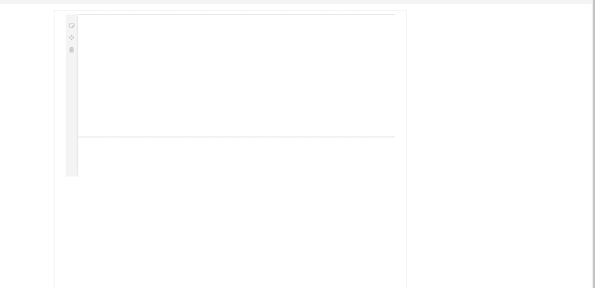

# RSS Reader SharePoint Webpart

## Summary
This webpart allows you to include an RSS feed of your choice into a Modern SharePoint page. The only required piece of information is the link to the RSS feed, however you can configure a title to display, as well as how many results you'd like displayed and how many characters are displayed in the descriptions.

This RSS Reader is built on top of [OlivierCC's](https://github.com/OlivierCC/spfx-40-fantastics) original from the 40 Fantastic Webparts repository. This version allows you to download the RSS Reader on it's own. This is a much smaller and managable package, and built in SPFx version 1.4.1 so no configuration is required, you can simply download the `ress-reader.sppkg` file in the `sharepoint` folder if you'd like to start using it right away.

## Applies to

* [SharePoint Framework](https:/dev.office.com/sharepoint)
* [Office 365 tenant](https://dev.office.com/sharepoint/docs/spfx/set-up-your-development-environment)

## Solution

Solution|Author(s)
--------|---------
RSS Reader|Paul Richard

## Version history

Version|Date|Comments
-------|----|--------
1.0|March 18, 2018|Initial release

## Disclaimer
**THIS CODE IS PROVIDED *AS IS* WITHOUT WARRANTY OF ANY KIND, EITHER EXPRESS OR IMPLIED, INCLUDING ANY IMPLIED WARRANTIES OF FITNESS FOR A PARTICULAR PURPOSE, MERCHANTABILITY, OR NON-INFRINGEMENT.**

---

## Minimal Path to Awesome

- Clone this repository
- in the command line run:
  - `npm install`
  - `gulp serve`